<div align="center">


<h1>Azure Migrate Extension</h1>

<p><strong>Factory-Grade Datacenter Modernization, Assessment Intelligence & Automated Migration Orchestration</strong></p>

[](https://devopstrio.co.uk/)
[](https://devopstrio.co.uk/)
[](https://devopstrio.co.uk/)
[](/apps/wave-engine)

</div>

---

## 🏛️ Executive Summary

The **Azure Migrate Extension** is a flagship enterprise platform designed to industrialize and accelerate the journey of legacy datacenter workloads to Microsoft Azure. Large-scale cloud transformations often struggle with dependency visibility, inaccurate right-sizing, and high-risk cutover windows. This platform extends the core capabilities of **Azure Migrate** with a layer of sophisticated orchestration, assessment intelligence, and factory-scale automation.

By integrating advanced **Discovery, Assessment, and Cutover Engines**, the platform establishes a high-throughput migration pipeline that automates the mapping of complex application dependencies, provides AI-driven right-sizing recommendations, and executes high-stakes cutovers using codified runbooks. It provides a boardroom-ready Command Center that gives executives real-time visibility into wave readiness, replication health, and program-level risk registries, ensuring a predictable and zero-downtime modernization experience.

### Strategic Business Outcomes
- **Industrialized Migration Velocity**: Achieve high-throughput migration waves through automated assessment scheduling and resource configuration standardization.
- **AI-Driven Cost Optimization**: Eliminate over-provisioning through sophisticated right-sizing analysis and Azure target recommendations before the first server is replicated.
- **Minimized Operational Risk**: Eliminate human error in high-pressure cutover windows through codified runbooks, automated DNS switchovers, and pre-flight validation testing.
- **Holistic Modernization Visibility**: Gain granular control over migration timelines, costs, and dependencies via a premium dashboard and automated executive reporting.

---

## 🏗️ Technical Architecture Details

### 1. High-Level Migration Factory Architecture
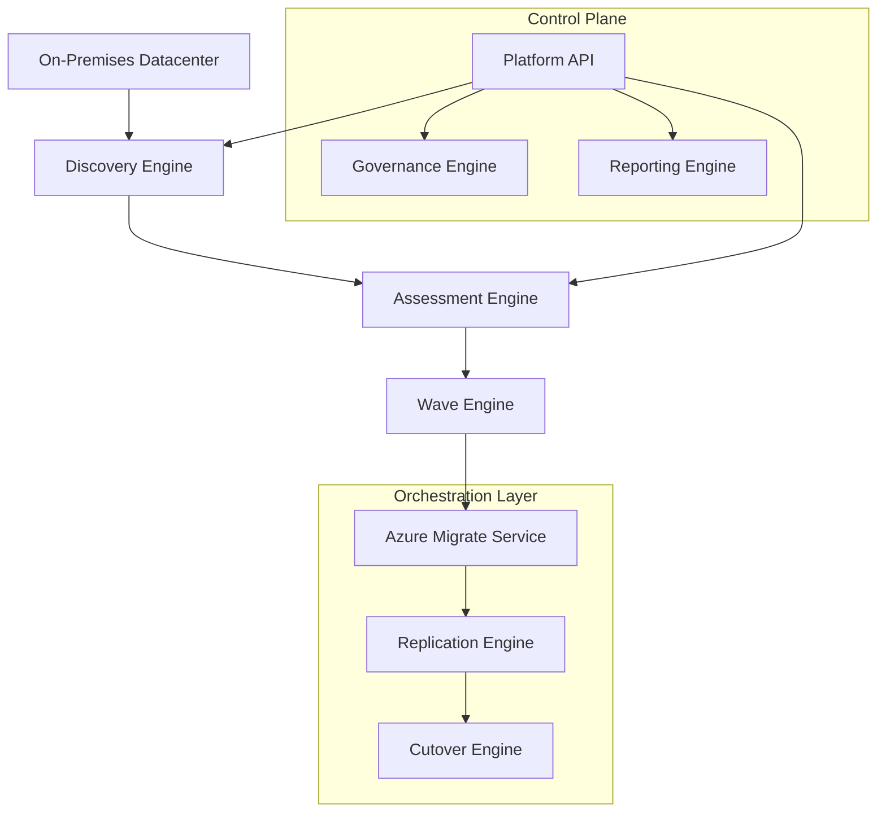

### 2. Discovery & Dependency Workflow
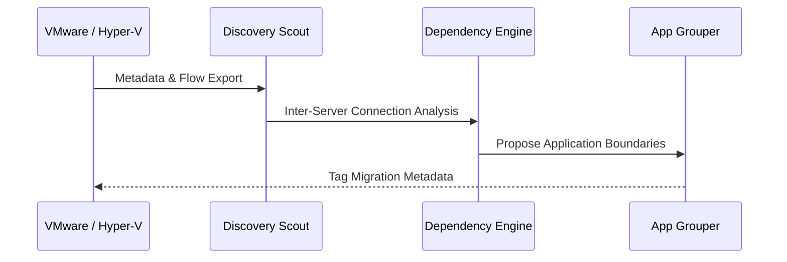

### 3. Assessment Intelligence Lifecycle
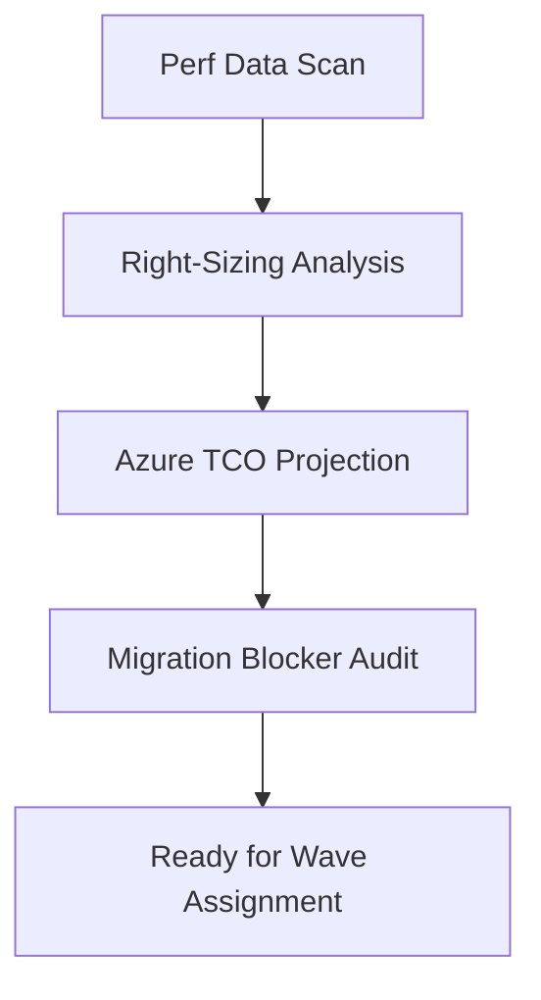

### 4. Wave Planning Lifecycle
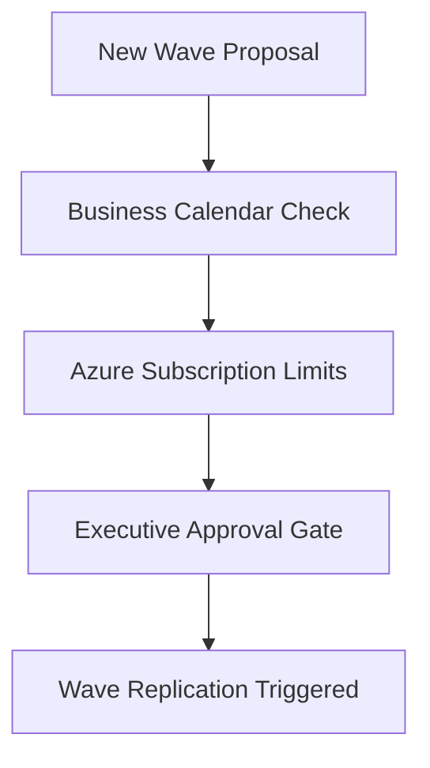

### 5. Replication Orchestration Flow
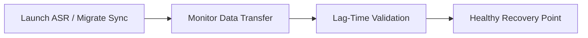

### 6. Cutover Execution Workflow
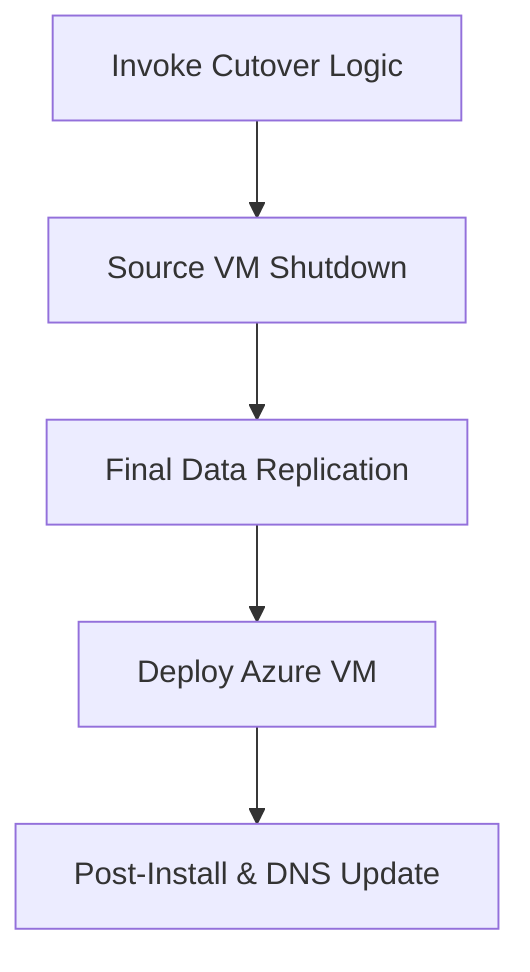

### 7. Security Trust Boundary
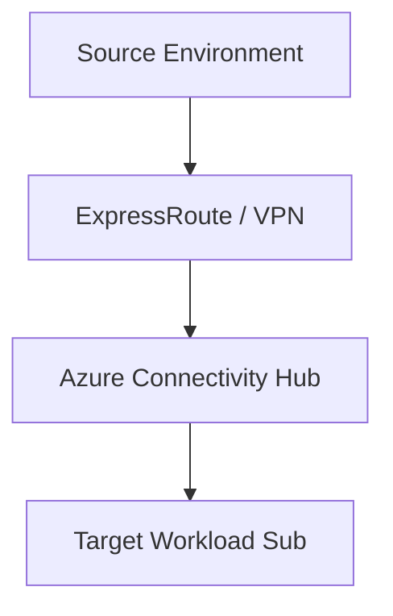

### 8. Azure Topology Overview
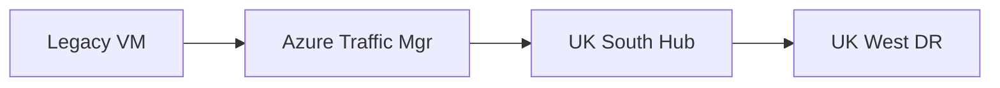

### 9. API Request Lifecycle
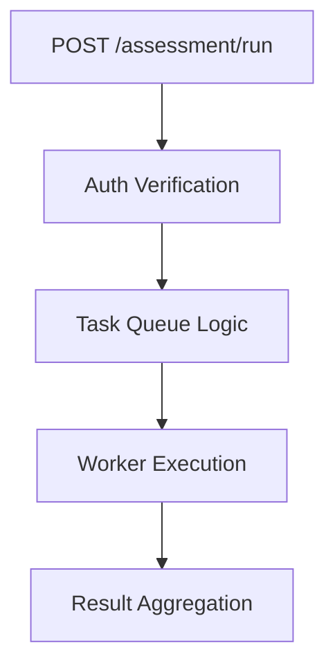

### 10. Multi-Tenant Tenancy Model
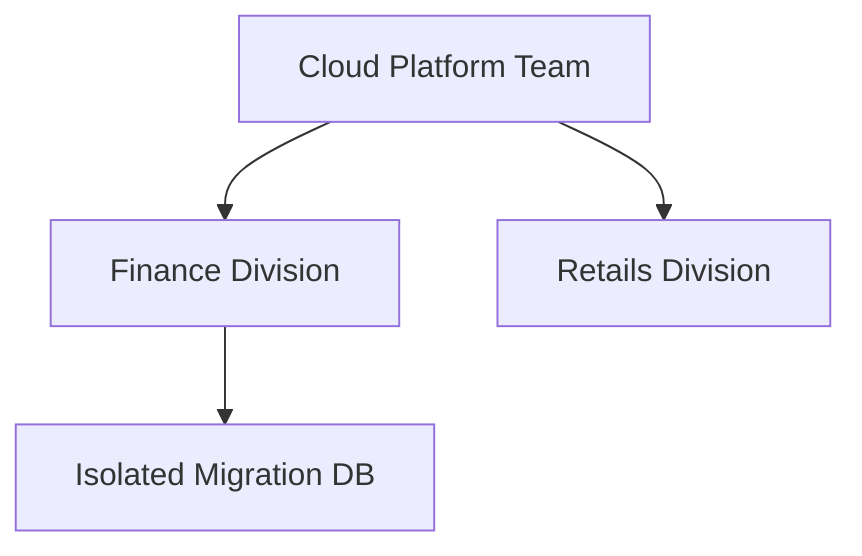

### 11. Monitoring & Throughput Flow
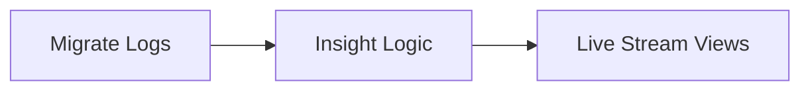

### 12. Disaster Recovery Topology
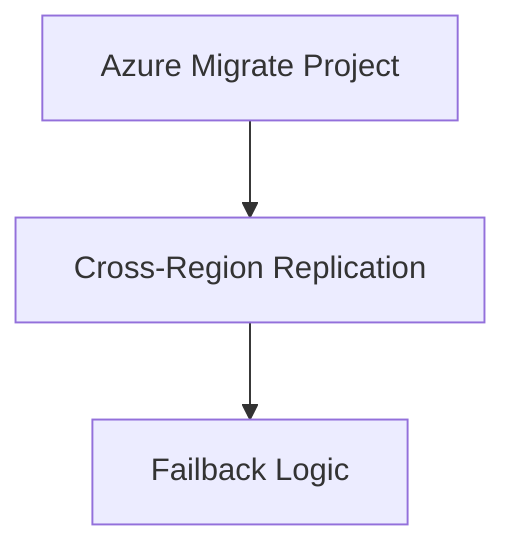

### 13. Dependency Mapping Flow
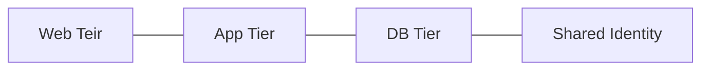

### 14. Identity Federation Model
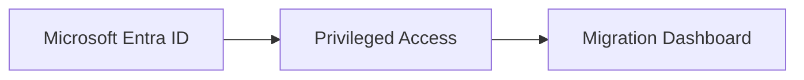

### 15. Executive Approval Gates
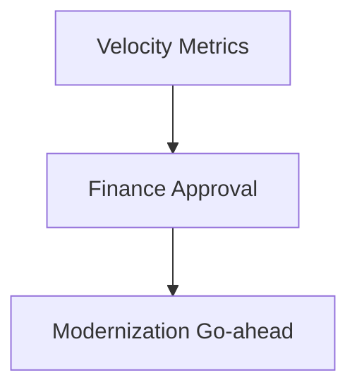

### 16. CI/CD Infrastructure Pipeline
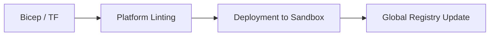

### 17. Rollback Lifecycle
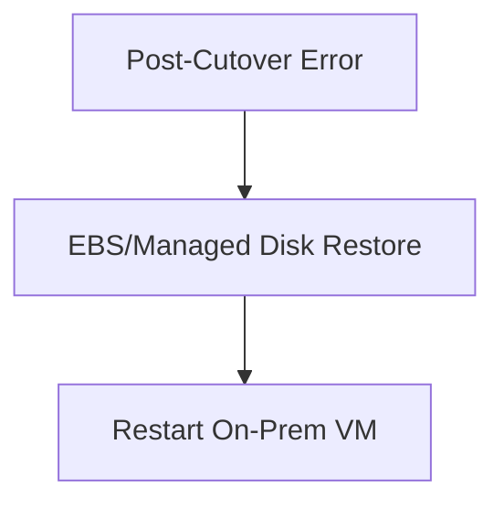

### 18. Global Region Topology
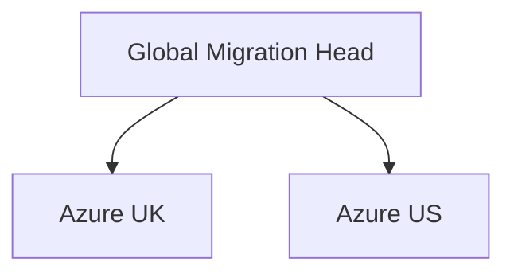

### 19. Hypercare Support Flow
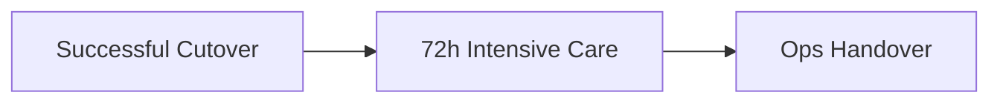

### 20. Cost Governance Workflow
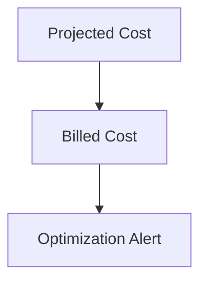

---

## 🚀 Deployment Guide

### Terraform Platform Rollout
```bash
cd terraform/environments/prd
terraform init
terraform apply -auto-approve
```

---
<sub>&copy; 2026 Devopstrio &mdash; Engineering the Scalable Foundation for the Next-Generation Cloud Modernization.</sub>
